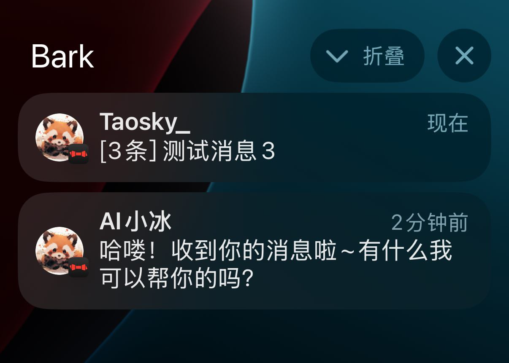
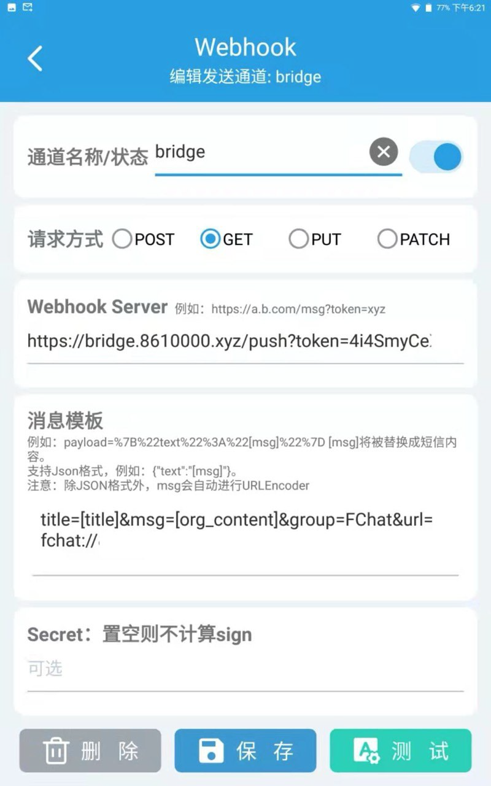
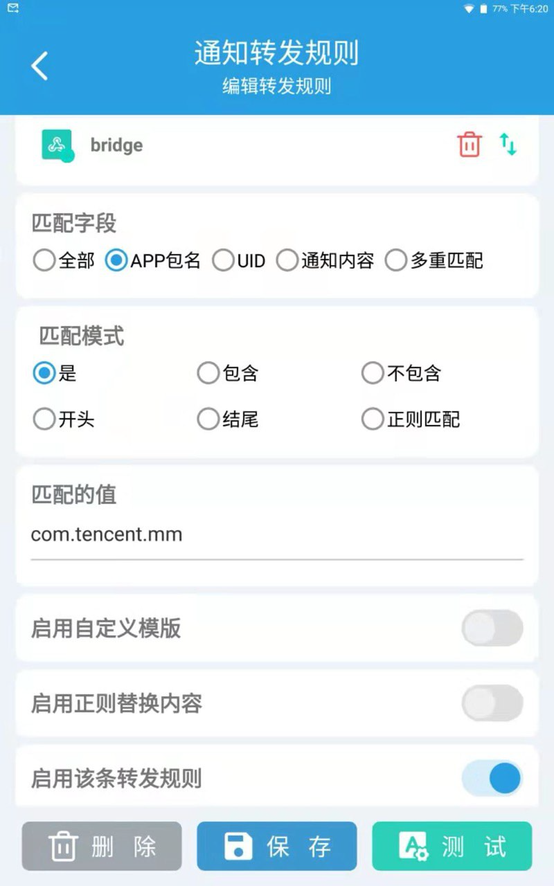
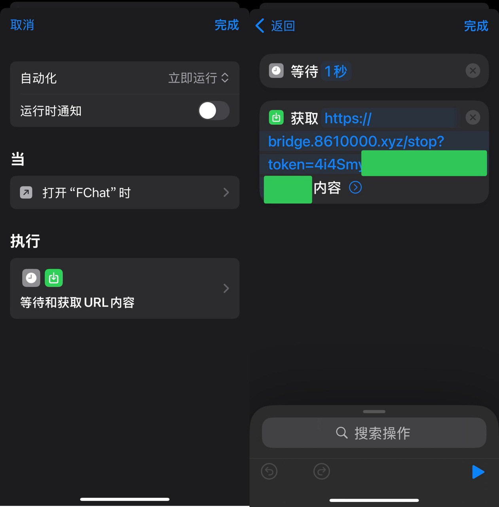
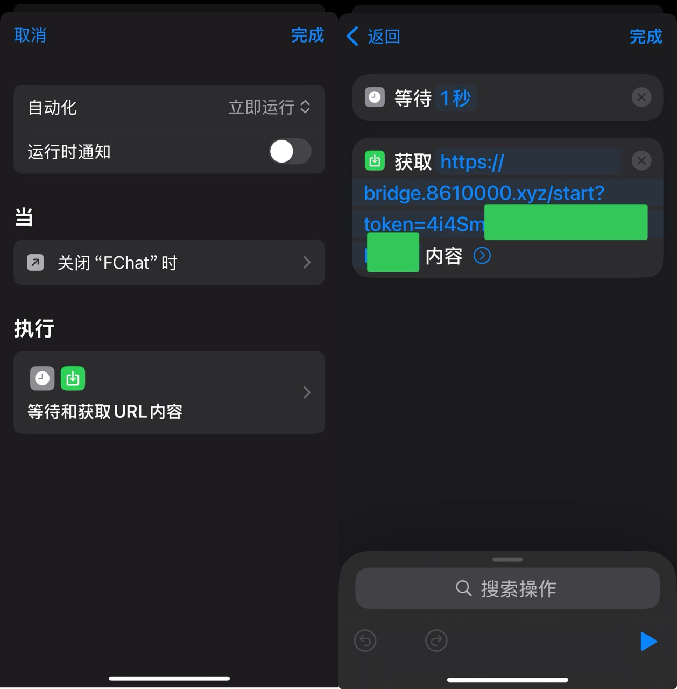

# wechat_bark_bridge 

一个简单的Flask服务器，用于SMSForwarder（WebHook），作为发送消息到Bark的“中间商”，解决SMSForwarder推送微信消息至Bark过程中的一些问题。

使用场景是闲置Android设备登录微信，iOS多开微信（注入插件后使用iPad登录），Android设备配置好SMSForwarder，将收到的微信消息转发给iOS Bark。

### 解决的问题
#### 多条消息多次推送问题

无法消除先前的消息，一个联系人发了三条消息通知，三条都会保留而不是显示最后一条`xxx: [3 条]`；点击Bark通知跳转微信（设置的 url ）后没办法把涉及微信的通知全部消除。

解决方案：通过服务端缓存20秒消息，对20秒中同一联系人的多条消息进行缓存，避免大量通知，提高通知体验。

#### 微信打开后仍收到通知

iOS多开微信打开后，不能像正常的微信一样停止新消息通知，体验比较差。

解决方案：提供/stop和/start接口，配合快捷指令，打开多开微信，通知服务器停止推送，关闭多开微信，通知服务器恢复推送，基本能够还原正常微信的使用体验。

### 配置方法

#### SMSForwarder

bridge.8610000.xyz可能存在不稳定情况，可以自己跑一个服务。

配置发送通道，token可从Bark中示例链接提取，group参数为iOS消息分组，url用于点击通知调起多开微信。

配置转发规则，匹配包名`com.tencent.mm`

#### 快捷指令

设置自动化，打开微信请求`/stop`，token同上。

关闭微信请求`/start`。

